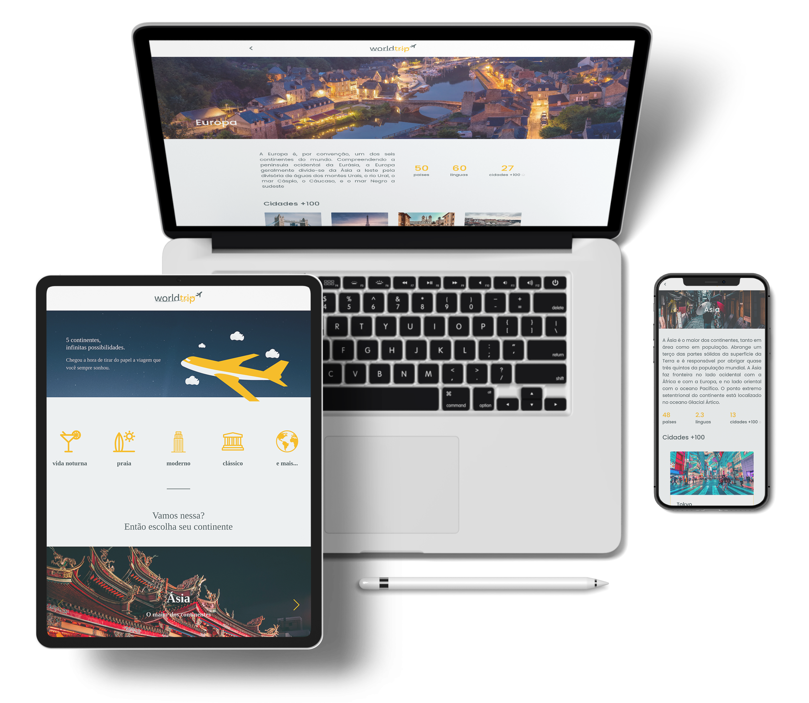

# WorldTrip 💛✈

&nbsp;


## 📚 Informações sobre o projeto

* Esse projeto foi desenvolvido durante um dos desafios dos capitulos do Ignite da Rocketseat! A ideia era desenvolver um site do zero seguindo o layout do Figma usando apenas o sistema do Chakra UI. Nesse projeto eu acrescentei alguns detalhes por conta própria, já que curti bastante trabalhar nele!

&nbsp;

## 💻 O que tem no projeto?

* Design completo usando completamente o Charka UI, também com sua versão responsiva.
* Slides usando Swiper.

&nbsp;

## 👨🏻‍💻 Funcionalidades desenvolvidas por mim
* Integração com o Prismic CMS, onde todas as informações usadas no site são armazenadas/criadas.
* Adicionado o uso do sistema estatico do Next.js, onde todas as rotas são pré-carregadas e salvas em cache.

&nbsp;



&nbsp;

## 🛠️ Tecnologias/Ferramentas ultilizadas

* [React](https://pt-br.reactjs.org/E)
* [Next.js](https://nextjs.org/)
* [Chakra UI](https://chakra-ui.com/)
* [Swiper](https://swiperjs.com/react)

&nbsp;


&nbsp;

## ⚙️ Instalação
```
# Abra um terminal e copie este repositório com o comando
$ git clone https://github.com/crisfeitosa/worldtrip.git
```

```
# Acesse a pasta da aplicação
$ cd worldtrip

# Crie um arquivo .env.local e coloque as variaveis
# de ambiente baseado no arquivo .env.example que
# se encontra na pasta worldtrip

# Instale as dependências
$ yarn

# Inicie a aplicação
$ yarn start

```

&nbsp;

### 🔗 Link para o projeto online


[WorldTrip](https://worldtrip-by-cris.netlify.app)

&nbsp;

## 📝 Licença

Este projeto está licenciado sob a Licença MIT.
